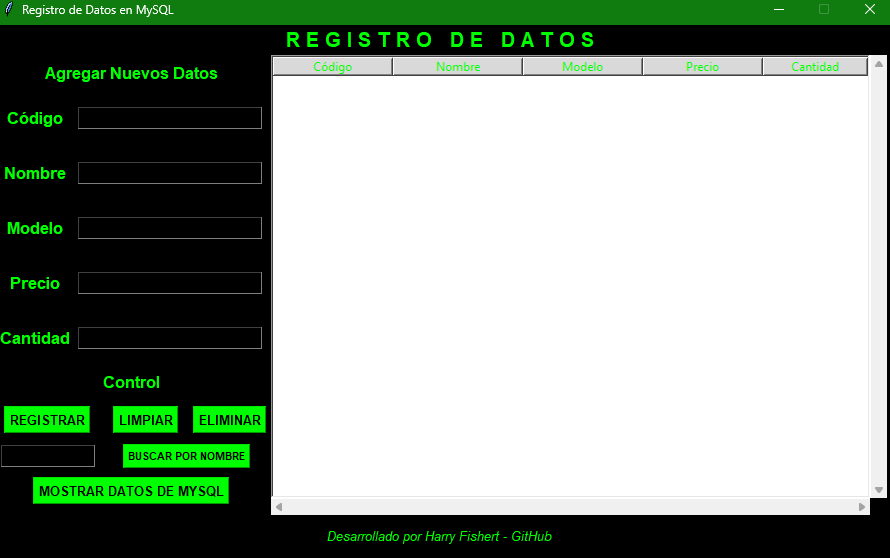

# Registro de Datos en MySQL

Este proyecto es una aplicación de escritorio desarrollada en Python utilizando la biblioteca `tkinter` para la interfaz gráfica y `mysql.connector` para la conexión con una base de datos MySQL. Permite gestionar un inventario de productos, incluyendo funcionalidades como agregar, buscar, mostrar y eliminar registros.

## Características

- **Interfaz gráfica**: Diseñada con colores en tonos **verde**, **negro** y **blanco**.
- **Gestión de productos**:
  - Agregar nuevos productos.
  - Buscar productos por nombre.
  - Mostrar todos los productos almacenados en la base de datos.
  - Eliminar productos.
- **Conexión a MySQL**: Utiliza `mysql.connector` para interactuar con la base de datos.
- **Pie de página**: Incluye un mensaje de crédito: `"Desarrollado por Harry Fishert - GitHub"`.


## Preview 



## Clonar este proyecto

Para clonar este repositorio, ejecuta el siguiente comando en tu terminal:

```bash
git clone https://github.com/tu-usuario/tu-repositorio.git
```

---

**Desarrollado por Harry Fishert - GitHub**
## Requisitos previos

Antes de ejecutar el proyecto, asegúrate de tener instalados los siguientes componentes:

1. **Python**: Versión 3.7 o superior.
2. **MySQL**: Un servidor MySQL en ejecución.
3. **Bibliotecas de Python**:
   - `mysql-connector-python`

Puedes instalar la biblioteca necesaria ejecutando:
```bash
pip install mysql-connector-python

